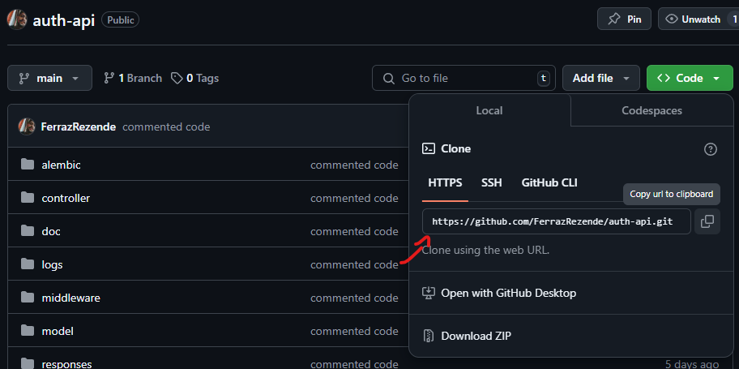
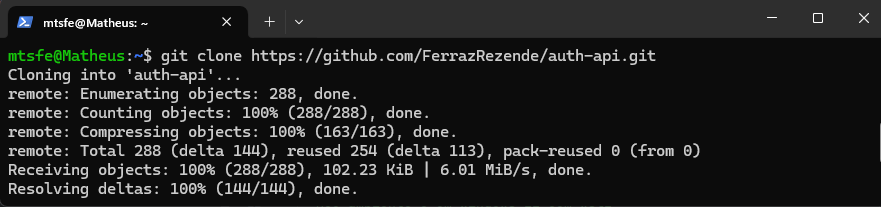
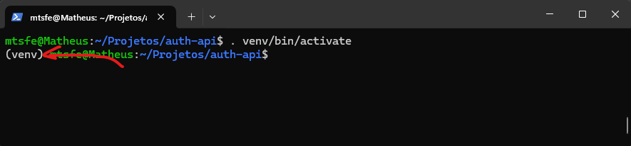
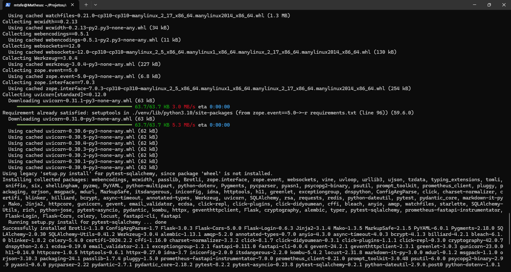

# AuthAPI - Guias How-To

## Passo a passo para iniciar a aplicação

### 1° Passo: clone o repositório
O primeiro passo é clonar o repositório do projeto AuthAPI. Para isso, você precisa acessar a página do GitHub do projeto e copiar o link de clonagem. Você pode usar a interface da linha de comando (CLI), Git ou um cliente GUI de sua preferência. Neste exemplo, usarei o Git.



> Nota: Este guia é baseado no uso do Windows 11 com WSL2 (Windows Subsystem for Linux). Se você estiver usando um sistema diferente, os comandos podem variar, porém qualquer máquina com Python instalado consegue rodar a aplicação.

Abra seu terminal (pode ser o CMD, PowerShell ou qualquer terminal do WSL) e execute o seguinte comando para clonar o repositório:


---

### 2° Passo: Defina as variáveis de ambiente
Após clonar o repositório, a próxima etapa é criar o arquivo .env na pasta raiz do projeto. Este arquivo é crucial para a configuração da sua aplicação, pois contém todas as variáveis de ambiente necessárias para o seu funcionamento adequado.

No diretório do projeto, você encontrará um arquivo chamado .env.example. Este arquivo serve como um modelo e contém todas as variáveis que você precisa definir. Aqui estão as variáveis que você deve incluir no seu arquivo .env:
```
PG_PASS=
PG_USER=
PG_DB=
PG_MAIL=
TEST_DB=

JWT_SECRET_KEY=
JWT_ALGORITHM=
JWT_EXPIRATION_TIME_MINUTES=

CREATE_TOKEN=

EXPIRATION_TIME=

MAIL_USER=
MAIL_PASS=

GRAFANA_PASS=
```

> Dica: Para garantir que a aplicação funcione corretamente, preencha cada variável conforme necessário. Para mais informações sobre como funcionam as variáveis de ambiente, recomendo a leitura deste artigo:
https://medium.com/@habbema/dotenv-9915bd642533

Durante o desenvolvimento do AuthAPI, utilizei as seguintes configurações de variáveis de ambiente, que você pode usar como referência:
```
PG_PASS=12345678
PG_USER=admin
PG_DB=authdb
PG_MAIL=admin@admin.com
TEST_DB=test_authdb

JWT_SECRET_KEY=9l%uoa367i)w0gw9557$^8(y9ma)-5=cez+vat8&7&)b4l-+tn
JWT_ALGORITHM=HS256
JWT_EXPIRATION_TIME_MINUTES=1000

CREATE_TOKEN=CTKN_aHkLO653V5GDNWxJdfE6d2hZqN2z6Qdwq9c

EXPIRATION_TIME=1000

MAIL_USER=mts2kcrossfire35@gmail.com
MAIL_PASS=jvmiexzppbtpdgqu

GRAFANA_PASS=12345678
```

---

### 3° Passo: Crie o ambiente virtual
Com as variáveis de ambiente devidamente configuradas, o próximo passo é instalar as dependências do projeto, que estão listadas no arquivo requirements.txt. Para isso, primeiro precisamos criar um ambiente virtual em Python, que nos permitirá gerenciar as bibliotecas do projeto de maneira isolada.

Dentro do diretório do projeto, você deve digitar o seguinte comando no terminal:
``` 
python3 -m venv venv
```

Este comando irá criar uma nova pasta chamada venv na raiz do projeto. Essa pasta contém todos os arquivos necessários para o seu ambiente virtual, permitindo que você instale pacotes específicos para este projeto sem interferir em outras aplicações Python que você possa ter no seu sistema.

**No Windows:**
```
. venv/Source/activate
```

**No Linux ou MacOS:**
```
. venv/bin/activate
```

> Nota: Após a ativação, você deve notar que o prompt do terminal muda para incluir o nome do ambiente virtual, indicando que ele está ativo. Seu terminal deverá ficar parecido com este exemplo:


---

### 4° Passo: Instale as dependências do projeto

Com o ambiente virtual ativado, você pode instalar as dependências do projeto usando o pip. 

Execute o seguinte comando no terminal:
```
pip install -r requirements.txt
```

Esse comando irá instalar todas as dependências na versão que está descrita no arquivo requirements.txt



### Iniciar os serviços que a aplicação utiliza

Com as dependências instaladas, devemos iniciar os serviços que o AuthAPI utiliza, por exemplo: postgresql, redis, grafana e etc

