# AuthAPI - Guias How-To

## Passo a passo para iniciar a aplicação

### 1° Passo: clonar o repositório
O primeiro passo é clonar o repositório do projeto AuthAPI. Para isso, você precisa acessar a página do GitHub do projeto e copiar o link de clonagem. Você pode usar a interface da linha de comando (CLI), Git ou um cliente GUI de sua preferência. Neste exemplo, usarei o Git.

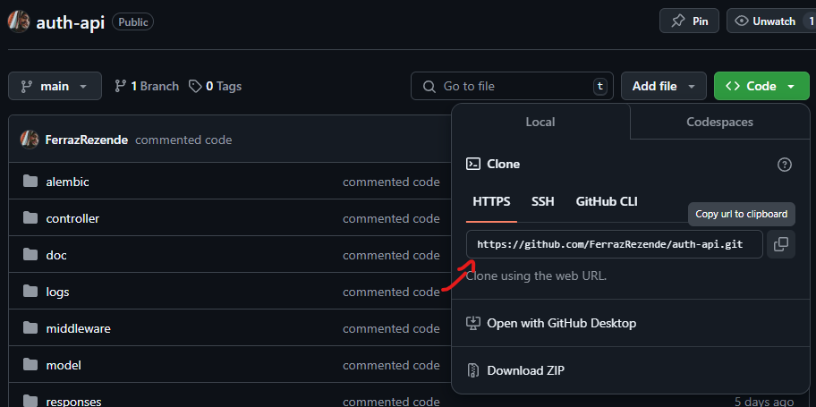

> Nota: Este guia é baseado no uso do Windows 11 com WSL2 (Windows Subsystem for Linux). Se você estiver usando um sistema diferente, os comandos podem variar, porém qualquer máquina com Python instalado consegue rodar a aplicação.

Abra seu terminal (pode ser o CMD, PowerShell ou qualquer terminal do WSL) e execute o seguinte comando para clonar o repositório:
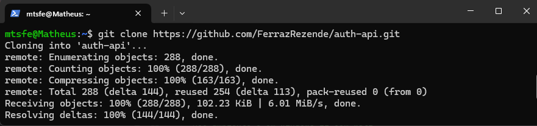

---

### 2° Passo: Definir as variáveis de ambiente
Após clonar o repositório, a próxima etapa é criar o arquivo .env na pasta raiz do projeto. Este arquivo é crucial para a configuração da sua aplicação, pois contém todas as variáveis de ambiente necessárias para o seu funcionamento adequado.

No diretório do projeto, você encontrará um arquivo chamado .env.example. Este arquivo serve como um modelo e contém todas as variáveis que você precisa definir. Aqui estão as variáveis que você deve incluir no seu arquivo .env:
```
PG_PASS=
PG_USER=
PG_DB=
PG_MAIL=
TEST_DB=

JWT_SECRET_KEY=
JWT_ALGORITHM=
JWT_EXPIRATION_TIME_MINUTES=

CREATE_TOKEN=

EXPIRATION_TIME=

MAIL_USER=
MAIL_PASS=

GRAFANA_PASS=
```

> Dica: Para garantir que a aplicação funcione corretamente, preencha cada variável conforme necessário. Para mais informações sobre como funcionam as variáveis de ambiente, recomendo a leitura deste artigo:
https://medium.com/@habbema/dotenv-9915bd642533

Durante o desenvolvimento do AuthAPI, utilizei as seguintes configurações de variáveis de ambiente, que você pode usar como referência:
```
PG_PASS=12345678
PG_USER=admin
PG_DB=authdb
PG_MAIL=admin@admin.com
TEST_DB=test_authdb

JWT_SECRET_KEY=9l%uoa367i)w0gw9557$^8(y9ma)-5=cez+vat8&7&)b4l-+tn
JWT_ALGORITHM=HS256
JWT_EXPIRATION_TIME_MINUTES=1000

CREATE_TOKEN=CTKN_aHkLO653V5GDNWxJdfE6d2hZqN2z6Qdwq9c

EXPIRATION_TIME=1000

MAIL_USER=mts2kcrossfire35@gmail.com
MAIL_PASS=jvmiexzppbtpdgqu

GRAFANA_PASS=12345678
```

---

### 3° Passo: Criar o ambiente virtual
Com as variáveis de ambiente devidamente configuradas, o próximo passo é instalar as dependências do projeto, que estão listadas no arquivo requirements.txt. Para isso, primeiro precisamos criar um ambiente virtual em Python, que nos permitirá gerenciar as bibliotecas do projeto de maneira isolada.

Dentro do diretório do projeto, você deve digitar o seguinte comando no terminal:
``` 
python3 -m venv venv
```

Este comando irá criar uma nova pasta chamada venv na raiz do projeto. Essa pasta contém todos os arquivos necessários para o seu ambiente virtual, permitindo que você instale pacotes específicos para este projeto sem interferir em outras aplicações Python que você possa ter no seu sistema.

**No Windows:**
```
. venv/Source/activate
```

**No Linux ou MacOS:**
```
. venv/bin/activate
```

> Nota: Após a ativação, você deve notar que o prompt do terminal muda para incluir o nome do ambiente virtual, indicando que ele está ativo. Seu terminal deverá ficar parecido com este exemplo:
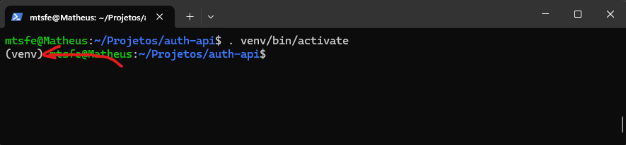

---

### 4° Passo: Instalar as dependências do projeto

Com o ambiente virtual ativado, você pode instalar as dependências do projeto usando o pip. 

Execute o seguinte comando no terminal:
```
pip install -r requirements.txt
```

Esse comando irá instalar todas as dependências na versão que está descrita no arquivo requirements.txt

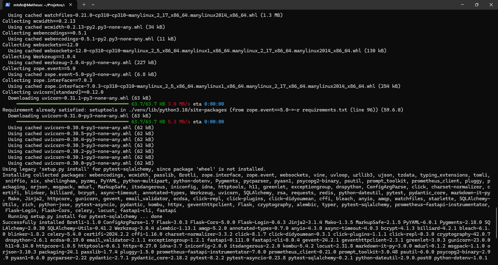

### 5° Passo:  Iniciar os serviços necessários para a aplicação


Após instalar as dependências, é necessário iniciar os serviços que a AuthAPI utiliza, como PostgreSQL, Redis, Grafana, entre outros.

No ambiente de desenvolvimento, nem todos os serviços precisam estar ativos, como o Nginx ou o container principal da aplicação (web). Para isso, podemos ajustar a execução do Docker Compose, limitando quais serviços serão iniciados. Use o seguinte comando:```
docker compose up -d --build --scale nginx=0 --scale web=0
```
docker compose up -d --build --scale nginx=0 --scale web=0
```
Esse comando inicia apenas os serviços essenciais, como:

* PostgreSQL
* PgAdmin
* Redis
* Grafana
* Prometheus

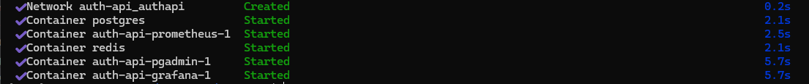

Para verificar se todos os serviços rodaram com sucesso, utilize o comando
```
docker ps
```

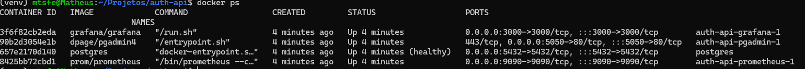

### 6° Passo: Configurar o banco de dados

Para conectar corretamente a aplicação ao banco de dados, é necessário obter o IP do container postgres e configurá-lo nos arquivos da aplicação.

#### 1. Obter o IP do container PostgreSQL

Execute o seguinte comando no terminal para inspecionar o container e encontrar o IP:

```
docker inspect postgres
```

#### 2. Localizar o IP

No resultado do comando, procure a chave "IPAddress", como mostrado abaixo:

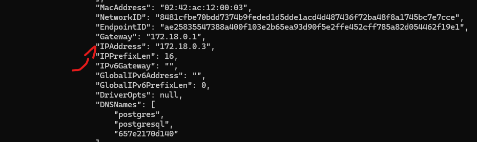

#### 3. Configurar o IP na aplicaçaõ
Com o IP em mãos, siga estas etapas:
* Arquivo settings.py
  * Insira o valor do IP na variável POSTGRES_IP

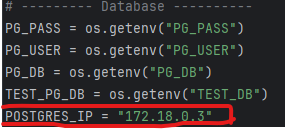

* Arquivo alembic.ini
  * Atualize a variável sqlalchemy.url com o IP obtido:

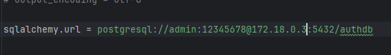

### 7° Passo: Aplicar as Migrações no Banco de Dados

Com o ambiente virtual (venv) ativado e estando na raiz do projeto, execute o seguinte comando para aplicar as migrações:
```
alembic upgrade head
```

Se o comando for executado com sucesso, você verá uma saída semelhante a esta:
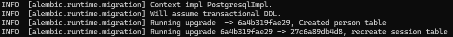

Esse comando garante que todas as alterações definidas nas migrações sejam aplicadas ao banco de dados, deixando-o atualizado e pronto para uso.

### 8° Passo: Iniciar a Aplicação

Agora que tudo está configurado, podemos iniciar a aplicação. Na raiz do projeto, execute o seguinte comando:

```
python server.py
```

Acessando a Aplicação
Após o servidor ser iniciado, a aplicação estará pronta para receber requisições. Para acessar a Swagger UI (documentação interativa), abra o navegador e acesse a rota onde a aplicação está hospedada, adicionando /docs ao final.

Exemplo:
```
localhost:8000/docs
```


Essa deverá ser a interface UI exibida:
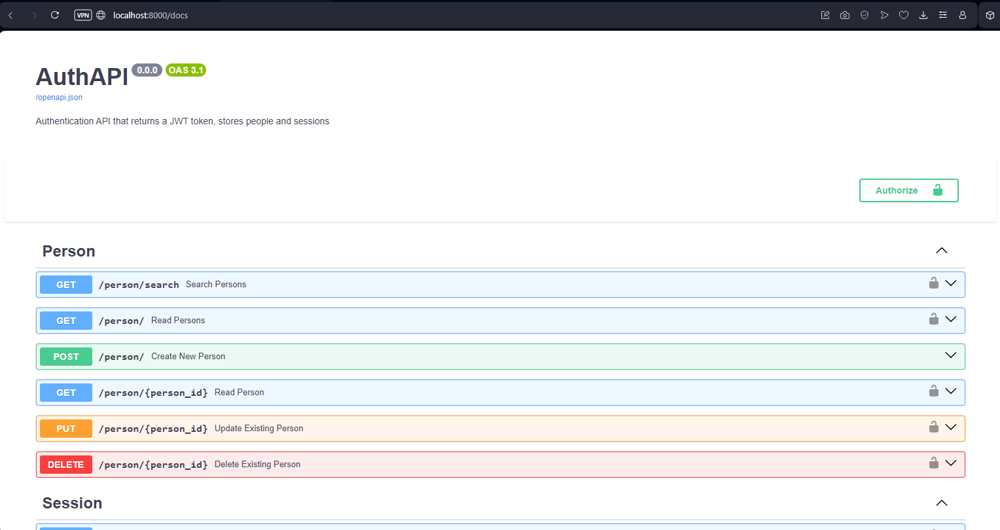

> Dica: A aplicação também oferece a documentação no formato ReDoc, acessível pela rota /redoc. O ReDoc é uma versão com um design mais moderno da documentação da API.


**Pronto para Usar 🚀**
Agora, você pode começar a [criar usuários](./user-doc.md#como-criar-pessoas) e realizar login na aplicação, explorando todas as funcionalidades disponíveis!

---

## Passo a passo para iniciar a aplicação com docker compose

O Docker Compose facilita a criação e gerenciamento do ambiente da aplicação com um único comando. Antes de prosseguir, verifique se alguns requisitos estão configurados:

> Observação: estamos continuando a partir do 2º passo do guia anterior.

### 1° Passo - Verifique se o Docker e o Docker Compose estão instalados

Antes de começar, verifique se o Docker e o Docker Compose estão corretamente instalados em seu sistema. Você pode verificar a instalação executando os seguintes comandos no seu terminal:

```
docker --version
docker-compose --version
```

Esses comandos devem retornar as versões instaladas. Se você não tiver o Docker e o Docker Compose instalados, consulte a [documentação oficial](https://docs.docker.com/engine/install/) para a instalação.

---

### 2° Passo - Inicie o container

Com as variáveis de ambiente já configuradas, inicie a aplicação em um container Docker usando o comando abaixo.

```
docker-compose up -d --scale nginx=0
```

A flag --scale permite definir a quantidade de instâncias de um serviço específico. No exemplo, --scale nginx=0 indica que queremos escalar o serviço nginx para zero instâncias, desativando-o temporariamente.

Após o comando, você deverá ver uma saída semelhante a esta:
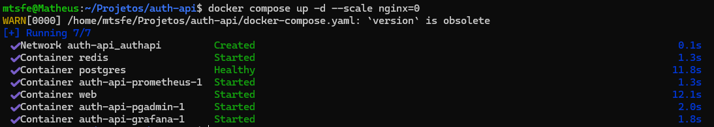

Para verificar se todos os serviços estão rodando corretamente, use:
```
docker ps
```

Se tudo estiver funcionando conforme o esperado, você verá uma lista dos containers ativos, semelhante a este exemplo:

### Passo Final: Encerrar os Containers
Quando terminar de utilizar a aplicação, é importante encerrar os containers Docker para liberar recursos do sistema. Para isso, execute o comando:

```
docker-compose down
```
Esse comando encerrará todos os containers relacionados ao projeto de forma segura.

---Agora a AuthAPI está completamente configurada e pronta para uso! Explore a aplicação e, caso tenha alguma dúvida, consulte a [documentação](../README.md) para conhecer as funcionalidades adicionais.